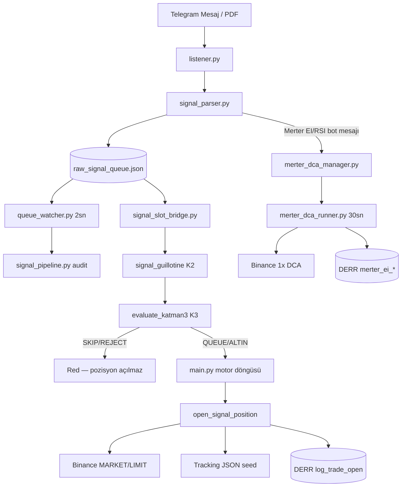

# MINA v2 — Sistem Analiz Raporu

**Tarih:** 2026-06-05  
**Sunucu:** 178.105.150.40 (`/root/MINA_v2`)  
**Ortam:** Binance Futures Testnet  
**Veri kaynağı:** Kod tabanı envanteri + canlı systemd unit'leri + DERR (`mina_trading_journal.db`)

---

## İçindekiler

1. [Kod tabanı tam envanteri](#1-kod-tabanı-tam-envanteri)
2. [Aktif servisler ve görevleri](#2-aktif-servisler-ve-görevleri)
3. [Slot ve kasa örneği (5000 USDT)](#3-slot-ve-kasa-örneği-5000-usdt)
4. [Sinyal akışı](#4-sinyal-akışı)
5. [Eksik ve çalışmayan şeyler](#5-eksik-ve-çalışmayan-şeyler)
6. [DERR istatistikleri](#6-derr-istatistikleri)

---

## 1. Kod tabanı tam envanteri

> **Not:** `node_modules/`, `.git/`, `venv/`, `__pycache__/` ve `dashboard/dist/assets/` (bundle) hariç tutulmuştur. Toplam anlamlı dosya: **~280**.

### 1.1 Kök dizin — çekirdek motor

| Dosya | Açıklama |
|-------|----------|
| `main.py` | Tek motor giriş noktası; 30 sn döngü, Binance sync, pozisyon evaluate |
| `mina_position_manager.py` | 4x TP/stop/savunma D1–D3 kararları ve emir icrası |
| `mina_trading_journal.py` | DERR SQLite journal — açılış/kapanış/savunma/reconcile |
| `mina_tracking.py` | State JSON dosyalarının tek kaynak CRUD katmanı |
| `mina_slot_policy.py` | 10 slot dağılım sabitleri (7+1 motor, 3 Merter DCA) |
| `mina_signal_source.py` | HT/MZ/MANUEL/yetim kaynak kodları ve orphan tespiti |
| `mina_entry_orders.py` | Bekleyen limit emirleri, stale iptal, fill işleme |
| `mina_dashboard_settings.py` | Dashboard `dashboard_settings.json` okuma/yazma |
| `open_fast_coins.py` | Testnet pozisyon açma yardımcıları (hedge, qty, step) |
| `open_eight_positions.py` | Testnet 8 pozisyon toplu açma scripti |
| `test_journal.py` | DERR unit test scripti |
| `test_ignition.py` | Motor ignition test scripti |
| `requirements.txt` | Python bağımlılıkları |
| `.env` | API/Telegram anahtarları (git dışı, sunucuda) |
| `*.json` (runtime) | `defense_levels`, `initial_margins`, `initial_entry_prices`, `max_prices`, `tp_levels`, `mina_position_state.json` |
| `mina_trading_journal.db` | DERR veritabanı (runtime) |
| `session*.session` | Telethon oturum dosyaları (Haluk/Merter/PDF) |

### 1.2 Dokümantasyon

| Dosya | Açıklama |
|-------|----------|
| `CLAUDE.md` | Motor anayasası — kasa, TP, savunma, testnet notları |
| `MINA_ANAYASASI.md` | Tek kaynak anayasa + backlog + dashboard gereksinimleri |
| `GEMINI_BRIEFING.md` | AI agent briefing — mimari, buglar, operasyon |
| `DERR_IMPLEMENTATION.md` | DERR şema ve kullanım detayları |
| `MERTER_SIGNAL_FLOW.md` | Merter sinyal akış diyagramı |
| `GUNCEL_NOTLAR.md` | Sunucu kararları, risk uyarıları, düzeltilen buglar |
| `SISTEM_KURALLARI.md` | Sistem kuralları özeti |
| `STRATEJI_NOTLARI.md` | Strateji notları |
| `LEVERAGE_RULES_VALIDATION.md` | Kaldıraç kuralları doğrulama notları |
| `README.md` | Proje giriş README |

### 1.3 `backend/` — Binance altyapı

| Dosya | Açıklama |
|-------|----------|
| `config.py` | BinanceConfig, AccountManager, slot = kasa/10 |
| `position_manager.py` | Binance futures pozisyon API sarmalayıcısı |
| `ghost_positions.py` | Hayalet pozisyon tespiti; Merter DCA ayrımı |
| `main.py` | Geriye uyumluluk — kök `main.py`'ye yönlendirir |
| `close_all_positions.py` | Tüm pozisyonları kapatma |
| `open_multiple_positions.py` | Çoklu test pozisyonu açma |
| `open_test_position.py` | Tek test pozisyonu |
| `_ping.py`, `_diagnose.py`, `_monitor.py`, `_snapshot.py` | Ad-hoc teşhis scriptleri |
| `_check_pos.py`, `_close_all_now.py`, `_open_test.py` | Operasyon/test yardımcıları |
| `_raw_order.py`, `_test_single_order.py` | Ham emir testleri |
| `tests/test_binance.py`, `test_trade.py`, `check_history.py` | Backend testleri |

### 1.4 `signal_bot/` — sinyal hattı

| Dosya | Açıklama |
|-------|----------|
| `listener.py` | Birleşik Telegram dinleyici (Haluk + Merter, Katman 0–1) |
| `signal_parser.py` | Parse, filtre, RVOL/RSI, `raw_signal_queue.json` yazımı |
| `haluk_pdf_parser.py` | Haluk PDF rapor parse + makro seviye çıkarımı |
| `signal_guillotine.py` | Katman 2 — confluence, parlaklık, REJECT/ALTIN/KUYRUK |
| `signal_slot_bridge.py` | Boş motor slotuna sinyal tüketimi, 30 dk TTL |
| `signal_pipeline.py` | Merter kuyruk girişlerinde pipeline audit + DERR kararı |
| `queue_watcher.py` | `raw_signal_queue.json` sürekli izleme (2 sn poll) |
| `merter_dca_manager.py` | Merter 1x DCA grid, filtre, TP/trailing/48s BE |
| `merter_dca_runner.py` | DCA pozisyon izleme döngüsü servisi |
| `merter_fetcher.py` | Merter kanal geçmişi çekme |
| `merter_tracker.py` | Merter pozisyon takip state (legacy yardımcı) |
| `macro_levels_store.py` | TOTAL, BTC.D, OTHERS makro seviye depolama |
| `raw_signal_queue.json` | Onaylı sinyal kuyruğu (runtime) |
| `merter_dca_state.json` | Merter DCA aktif yuvalar (runtime) |
| `queue_watcher_state.json` | İşlenmiş fingerprint state |
| `test_*.py` | Parser/simülasyon testleri |

### 1.5 `dashboard/` — arayüz

| Dosya | Açıklama |
|-------|----------|
| `dashboard_ws.py` | WebSocket sunucu (:8765), 5 sn veri yayını |
| `src/App.jsx` | Ana layout, sekme yönetimi |
| `src/components/PositionTable.jsx` | Motor + Merter pozisyon tablosu |
| `src/components/DefensePanel.jsx` | D1/D2/D3 savunma görselleştirme |
| `src/components/OrderPanel.jsx` | Manuel al/sat + slot bar |
| `src/components/SettingsPanel.jsx` | Motor toggle, Merter zaman stopu, Telegram |
| `src/components/MacroLevelsPanel.jsx` | Haluk makro seviye paneli |
| `src/hooks/useWebSocket.js` | WS bağlantı hook'u |
| `vite.config.js` | Vite build/dev yapılandırması |
| `dist/index.html` | Production static build çıktısı |

### 1.6 `scripts/` — deploy ve operasyon (~90 dosya)

**Deploy:** `deploy_full.py`, `deploy_dashboard.py`, `deploy_listener.py`, `deploy_merter_dca.py`, `deploy_pipeline_watcher.py`, `deploy_server_sync.py`, `deploy_slot_bridge.py`, `deploy_signal_parser.py`

**Operasyon:** `bootstrap_production.py`, `sabah_kontrol.py`, `morning_check*.py`, `quick_status*.py`, `reconcile_*.py`, `report_*.py`, `investigate_*.py`, `fix_listener.py`, `manual_open.py`, `open_six_test_positions.py`

**Backtest:** `scripts/backtest/backtest.py`, `backtest_v2.py`, `backtest_filtered.py`

**Teşhis:** `_grep_*.py`, `_remote_gorev*.py`, `_journal_d1.sh`, `_tail_btc_log.sh`

### 1.7 `systemd/` — repodaki unit dosyaları

| Dosya | Açıklama |
|-------|----------|
| `mina-merter-dca.service` | Merter DCA runner unit şablonu |
| `mina-queue-watcher.service` | Kuyruk izleyici unit şablonu |

> Diğer 4 unit (`mina-engine`, `mina-listener`, `mina-dashboard-ws`, `mina-dashboard-vite`) sunucuda `/etc/systemd/system/` altında deploy scriptleriyle oluşturulmuş.

### 1.8 `tools/`, `tests/`, `engine/`

| Dosya | Açıklama |
|-------|----------|
| `tools/telegram_bot.py` | Telegram bildirim botu |
| `tools/read_history.py` | Geçmiş okuma aracı |
| `tools/transcript_fetcher.py` | YouTube transcript çekici |
| `tests/test_dashboard.py` | Dashboard E2E test |
| `engine/strategy.py` | Eski strateji modülü (kullanılmıyor) |
| `engine/websocket_manager.py` | Eski WS yöneticisi (kullanılmıyor) |

---

### 1.9 Arşiv, legacy ve kullanılmayan dosyalar

#### `_archive/` (bilinçli arşiv)

| Dosya | Durum |
|-------|-------|
| `_archive/README.md` | Arşiv açıklaması |
| `_archive/engine/main.py` | Eski monolitik motor (~1400 satır) — **canlıda çalışmaz** |

Git geçmişinde silinmiş, arşivde kopyası yok:
- `backend/defense_system.py`, `backend/exit_system.py`, `backend/strategy_manager.py`

#### Legacy sinyal bot (birleştirildi, çalıştırılmamalı)

| Dosya / Servis | Not |
|----------------|-----|
| `signal_bot/ht_listener.py` | Eski Haluk-only dinleyici → `listener.py` |
| `signal_bot/pdf_listener.py` | Eski PDF dinleyici → `haluk_pdf_parser.py` |
| `signal_bot/approval_bot.py` | Eski onay botu |
| `signal_bot/pdf_parser.py`, `tracker.py`, `history_fetcher.py` | Eski yardımcılar |
| `pdf_listener.service`, `mina-pdf-listener`, `mina-ht-listener` | Eski systemd — `stop_pdf_listener.py` ile kapatılmalı |

#### Operasyon çıktıları (kaynak kod değil)

`d1_fail_out.txt`, `investigate_out.txt`, `movr_analysis.txt`, `overnight_report_out.txt`, `report_*_out.txt`, `zro_*_out.txt`, `reconcile_verify.txt`, `open_eight_last_run.txt`

#### Test / geçici scriptler (prod akışta değil)

`open_eight_positions.py`, `open_fast_coins.py`, `backend/_*.py`, `scripts/_*.py` (grep/teşhis), `signal_bot/history/*.txt` (transcript arşivi)

---

## 2. Aktif servisler ve görevleri

Sunucudaki canlı unit tanımları (2026-06-05):

| Servis | Çalıştırdığı dosya | Döngü / tetik | Görev |
|--------|-------------------|---------------|-------|
| **mina-engine** | `/root/MINA_v2/main.py` | **30 sn** (`MINA_CHECK_INTERVAL`, varsayılan) | 4x motor: pozisyon evaluate, TP/stop/savunma, pending limit fill, ghost scan, engine-side trailing |
| **mina-listener** | `signal_bot/listener.py` | **Event-driven** (Telegram async) | Haluk + Merter mesaj dinleme → parse → kuyruk |
| **mina-merter-dca** | `signal_bot/merter_dca_runner.py` | **30 sn** (`MERTER_DCA_INTERVAL`) + **5 dk** reconcile | Merter 1x DCA: TP1/TP2/trailing, 48s breakeven, DERR sync |
| **mina-queue-watcher** | `signal_bot/queue_watcher.py` | **2 sn** (`POLL_SEC`) | Yeni Merter kuyruk kayıtları → pipeline audit + guillotine log |
| **mina-dashboard-ws** | `dashboard_ws.py` (cwd: `/root/MINA_v2`) | **5 sn** (`asyncio.sleep(5)`) | WS :8765 — bakiye, pozisyon, state JSON, log stream |
| **mina-dashboard-vite** | `python3 -m http.server 3000` | Static HTTP | Dashboard UI (`dashboard/dist`) port **3000** |

### Bağımlılık sırası

```
mina-listener → mina-queue-watcher (After)
mina-engine   → mina-merter-dca (After)
```

### Log dosyaları

| Servis | Log |
|--------|-----|
| mina-engine | `/root/MINA_v2/mina_bot.log` |
| mina-listener | `/root/MINA_v2/signal_bot/signals_log.txt` |
| mina-queue-watcher | `/root/MINA_v2/signal_bot/pipeline_audit.log` |
| mina-merter-dca | stdout/journal + `merter_dca.log` |
| mina-dashboard-ws | `/root/MINA_v2/dashboard_ws.log` |

---

## 3. Slot ve kasa örneği (5000 USDT)

### 3.1 Toplam dağılım (10 slot)

```
Kasa (Binance USDT)     = 5000 USDT
1 Slot                  = Kasa / 10 = 500 USDT
```

| Bölüm | Slot sayısı | Bütçe | Yuvalar |
|-------|-------------|-------|---------|
| **Haluk 4x motor** | 7 | 7 × 500 = **3500 USDT** | K2/K3 onaylı pipeline |
| **Merter 4x legacy** | 1 | 1 × 500 = **500 USDT** | Kuyruk köprüsü (motor) |
| **Motor toplam** | **8** | **4000 USDT** | `MOTOR_SLOT_MAX = 8` |
| **Merter EI #1** (`merter_ei_1`) | 1 | **500 USDT** | Süzgeçli EI DCA |
| **Merter EI #2** (`merter_ei_2`) | 1 | **500 USDT** | Süzgeçsiz EI DCA |
| **Merter RSI** (`merter_other`) | 1 | **500 USDT** | RSI<20 DCA |
| **Merter DCA toplam** | **3** | **1500 USDT** | 1x isolated, stop yok |
| **GENEL TOPLAM** | **10** | **5000 USDT** | |

### 3.2 4x motor — tek slot örneği (500 USDT slot)

| Adım | Formül | USDT |
|------|--------|------|
| Giriş marjini | slot / 5 | **100** |
| Hacim (4x) | marjin × 4 | **400** |
| D1 ekleme | slot / 5 | **+100** |
| D2 ekleme | slot / 5 | **+100** |
| D3 ekleme (hayalet SFP) | slot × 2/5 | **+200** |
| **Maksimum risk (1 slot)** | | **500 USDT** |

Savunma tetikleyicileri **spot fiyat** üzerinden (ROE değil):
- D1: `mark ≤ initial_entry × 0.95`
- D2: `mark ≤ initial_entry × 0.88`
- D3: 4H destek + 5m bull bar (hayalet)
- Hard stop: `mark ≤ initial_entry × 0.75`

### 3.3 Merter 1x DCA — tek yuva örneği (500 USDT slot)

| Kavram | Formül | USDT |
|--------|--------|------|
| Yuva bütçesi | 1 slot | **500** |
| 1 parça (1/10) | slot / 10 | **50** |
| İlk giriş | 1 parça MARKET | **50** |
| DCA limitleri | 9 parça, %2 adımlarla | 9 × 50 = 450 (max) |
| Kaldıraç | 1x isolated | stop yok |

**Merter yuvaları:**

| Yuva | Filtre | İlk giriş |
|------|--------|-----------|
| `merter_ei_1` | RVOL≥2 + EMA20 + SFP + hacim + pump koruması | 50 USDT |
| `merter_ei_2` | Filtre yok — EI listesinden doğrudan | 50 USDT |
| `merter_other` | RSI<20 + teyit + hacim | 50 USDT |

---

## 4. Sinyal akışı

### 4.1 Genel diyagram



### 4.2 Adım adım — Haluk / Merter → 4x motor

| # | Adım | Modül | Kontroller | Red nedeni |
|---|------|-------|------------|------------|
| 0 | Telegram mesaj alınır | `listener.py` | API_ID/HASH, kanal ID, lock dosyası | Duplicate listener PID |
| 1 | Parse | `signal_parser.py` | Haber alarmı, makro filtre (TOTAL3 vb.), sembol normalizasyonu | `NEWS_ALARM`, makro-only, geçersiz sembol |
| 2 | Kuyruğa yaz | `enqueue_records()` | `status=approved`, sembol ≠ SYSTEM | `rejected` statüsü |
| 3 | Pipeline audit | `queue_watcher.py` → `signal_pipeline.py` | Merter kaynaklı girişlerde fragment log + DERR karar kaydı | — |
| 4 | Katman 2 — Guillotine | `signal_guillotine.py` | TOTAL yönü, seans parlaklığı, SFP bayrağı, LONG+TOTAL↓ çelişkisi | **REJECT:** TOTAL aşağı + Merter LONG (F1) |
| 5 | Katman 3 | `evaluate_katman3()` | K2 label → aksiyon | **SKIP:** REJECT; **QUEUE_LOW:** düşük öncelik |
| 6 | Slot köprüsü | `signal_slot_bridge.py` | Motor pause, max 8 pozisyon, slot marjin tavanı (%98), 30 dk TTL, zaten açık key | MAX_POSITIONS, MARGIN_CAP, TTL expired, duplicate key |
| 7 | Emir | `open_signal_position()` | LIMIT vs MARKET (`resolve_entry_order`), qty round | Binance API hatası, qty=0 |
| 8 | Seed | `_seed_tracking()` | initial_entry, margins, defense=0, max_prices | — |
| 9 | DERR | `log_position_open()` | signal_source HT/MZ | Journal hatası |

**Pozisyon kapandığında:** `signal_slot_bridge` en yüksek parlaklıklı onaylı sinyali seçer → yeni pozisyon açar.

### 4.3 Adım adım — Merter 1x DCA (ayrı hat)

| # | Adım | Kontroller | Red nedeni |
|---|------|------------|------------|
| 1 | Telegram EI/RSI mesajı | `merter_dca_manager` doğrudan veya parser | Boş yuva yok |
| 2 | Yuva seçimi | `merter_ei_1` / `merter_ei_2` / `merter_other` | Dolu yuva |
| 3 | Filtre | RVOL≥2, RSI<20, hacim≥50M, pump koruması | Filtre fail |
| 4 | Giriş | 1 parça MARKET + 9 LIMIT (%2 DCA) | Binance -1109 vb. |
| 5 | İzleme | `merter_dca_runner` 30 sn | TP1 +3%, TP2 +5%, trailing %2, 48s BE |
| 6 | DERR | `signal_source=merter_ei_*` / `merter_other` | — |

Motor (`main.py`) Merter 1x pozisyonları `is_merter_dca_position()` ile **atlar** — çift yönetim engellenir.

### 4.4 Onay sonrası ne olur?

- **4x motor:** Binance isolated 4x hedge pozisyon + tracking JSON + DERR açık kayıt
- **Merter DCA:** Binance isolated 1x pozisyon + `merter_dca_state.json` + DERR
- **Dashboard:** WS üzerinden 5 sn'de güncellenir

---

## 5. Eksik ve çalışmayan şeyler

### 5.1 Testnet kısıtlamaları (kodda var, prod'da farklı)

| Konu | Durum |
|------|-------|
| `TRAILING_STOP_MARKET` / conditional emirler | Testnet **-4120** — reddedilir |
| Çözüm | Engine-side manuel trailing (`max_prices.json` seed zorunlu) |
| Algo trailing endpoint | `/fapi/v1/order/algo/trailing` — **gerçek hesapta test edilmedi** |
| D2 BE emri | TAKE_PROFIT_MARKET testnet'te sorunlu → LIMIT fallback gerekebilir |

### 5.2 Kodda var, eksik veya kısmi çalışan

| Konu | Detay |
|------|-------|
| Kısmi TP → DERR qty | TP1/TP2 sonrası `open_qty` güncellenmiyordu — `reconcile_open_qty()` eklendi (manuel/script) |
| D1 `_execute_d1` log | Hatalar `print()` ile — `mina_bot.log`'da görünmeyebilir |
| `signal_slot_bridge` | Sunucuda syntax bug vardı (`score_entry`) — düzeltildi |
| Dashboard Merter slot UI | Parça doluluk (3/10), ayrı bölüm — **henüz yok** |
| Dashboard RVOL kartı | Canlı RVOL gösterimi — **henüz yok** |
| RSI>70 LONG reddi | Backlog — **kodlanmadı** |
| Fiyat EMA20 altı LONG reddi | Backlog — **kodlanmadı** |
| 4H SFP dinamik destek | Sabit algoritma; dinamik 20–50 mum fitil — **backlog** |
| D3 öncesi bakiye yeniden hesaplama | **Yapılmadı** |
| Order retry mekanizması | **Yapılmadı** |
| Global risk limiti | **Yapılmadı** |
| Backtest sistemi | Scriptler var, prod entegrasyonu yok |

### 5.3 Backlog (MINA_ANAYASASI.md)

1. **D1/D2 sabit vs dinamik** — 50 işlem DERR analizi sonrası karar
2. **RSI > 70 → LONG reddet** (Merter)
3. **Fiyat EMA20 altında → LONG reddet** (Merter)
4. **4H SFP dinamik destek** algoritması
5. **Dashboard:** Merter yuva parça doluluk, RVOL kartı
6. **Gerçek hesap öncesi:** trailing algo test, D3 bakiye recalc, order retry, slot limit edge case

### 5.4 Gerçek hesaba geçmeden önce checklist

- [ ] Trailing stop Algo endpoint test
- [ ] D3 öncesi bakiye yeniden hesaplama
- [ ] Order retry mekanizması
- [ ] Slot limit fix / edge case'ler
- [ ] Merter/Motor aynı sembol çakışma senaryoları
- [ ] Hetzner Frankfurt prod sunucu kurulumu
- [ ] DERR'de her açılış/kapanış zorunlu (`log_trade_open` / `log_trade_close`)
- [ ] `max_prices.json` her restart'ta seed

---

## 6. DERR istatistikleri

**Kaynak:** `/root/MINA_v2/mina_trading_journal.db` — 2026-06-05 canlı sorgu

### 6.1 Özet

| Metrik | Değer |
|--------|-------|
| Toplam kayıt | **35** |
| Açık | **4** |
| Kapalı | **31** |
| Realized PnL (kapalı işlemler) | **-312.15 USDT** |
| Kazanan | **14** |
| Kaybeden | **17** |
| **Win rate** | **45.16%** |

### 6.2 En kârlı işlemler (top 3)

| ID | Sembol | Yön | PnL (USDT) | Kapanış nedeni |
|----|--------|-----|------------|----------------|
| 8 | USUSDT | LONG | **+47.17** | Reconciliation (Binance kapalı) |
| 23 | MOVRUSDT | LONG | **+16.63** | Trailing |
| 17 | DOTUSDT | SHORT | **+5.92** | Trailing |

### 6.3 En zararlı işlemler (top 3)

| ID | Sembol | Yön | PnL (USDT) | Kapanış nedeni |
|----|--------|-----|------------|----------------|
| 5 | LABUSDT | LONG | **-224.57** | Reconciliation (Binance kapalı) |
| 12 | INJUSDT | LONG | **-53.48** | Reconciliation (Binance kapalı) |
| 6 | BCHUSDT | LONG | **-45.30** | Reconciliation (Binance kapalı) |

### 6.4 Kaynak bazında

| signal_source | İşlem | Kapalı | Realized PnL |
|---------------|-------|--------|--------------|
| null (eski kayıtlar) | 20 | 20 | -305.81 USDT |
| MANUEL | 6 | 3 | -1.06 USDT |
| MZ | 5 | 5 | -0.15 USDT |
| merter_other | 1 | 1 | +0.42 USDT |
| merter_ei_2 | 1 | 0 | 0 (açık) |
| merter_ei_1 | 1 | 1 | -0.25 USDT |
| merter_ei | 1 | 1 | -5.30 USDT |

### 6.5 Kapanış nedeni bazında

| close_reason | Adet | Toplam PnL |
|--------------|------|------------|
| Reconciliation (Binance kapalı) | 17 | -330.60 USDT |
| Trailing | 11 | +29.63 USDT |
| Stop Loss | 2 | -11.54 USDT |
| Zaman stopu BE | 1 | +0.37 USDT |

### 6.6 Yorum

- Realized PnL'in büyük kısmı **eski testnet hesabı reconcile** kayıtlarından (17 işlem, -330 USDT) geliyor; yeni hesap temiz başlangıç sonrası veri henüz az.
- Trailing ile kapanan 11 işlem **net pozitif** (+29.63 USDT).
- DERR'de `signal_source=null` olan 20 eski kayıt migrate edilmedi — istatistikleri kirletiyor.
- Yeni testnet döneminde MANUEL 6 pozisyon açıldı; 3'ü kapanmış (DOT trailing reconcile dahil).

---

## Ek: Mimari özet

```
┌─────────────────────────────────────────────────────────────┐
│                    10 SLOT = KASA / 10                       │
├──────────────────────┬──────────────────────────────────────┤
│  4x MOTOR (8 slot)   │  MERTER 1x DCA (3 slot)              │
│  main.py 30sn        │  merter_dca_runner 30sn              │
│  Haluk×7 + Merter×1  │  ei_1 + ei_2 + other                 │
│  TP/D1-D3/Trailing   │  DCA grid / TP / 48s BE              │
└──────────────────────┴──────────────────────────────────────┘
         │                              │
         └────────── DERR (SQLite) ─────┘
                        │
              dashboard_ws :8765 (5sn)
                        │
              dashboard UI :3000 (static)
```

---

*Rapor otomatik üretilmiştir. Güncelleme: deploy veya anayasa değişikliği sonrası `scripts/derr_stats_export.py` ile DERR bölümü yenilenebilir.*
